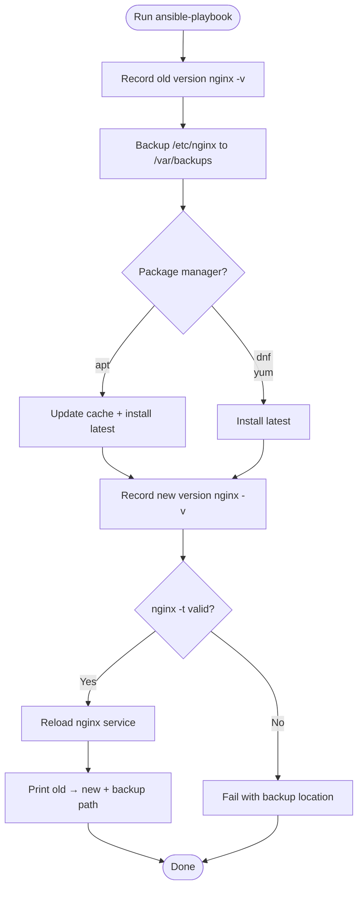

# Ansible Linux Server Management

Ansible project for Linux server management: inventory definition and automation playbooks.

## Requirements

- Ansible installed on the control node: `pip install ansible`
- SSH access to managed hosts (user `ansible`, sudo for escalated plays)
- Python + pyyaml on the control node for local YAML validation

## Repository layout

```
├── ansible.cfg              # global config: inventory path, SSH, sudo escalation
├── inventory/
│   └── hosts.yml            # static inventory (webservers, dbservers, monitoring, staging)
└── playbooks/
    ├── nginx-upgrade.yml    # upgrade nginx, backup config, verify, reload
    └── mysql-setup.yml      # install MySQL, secure root login, create db + user
```

> `mysql-setup.yml` requires the `community.mysql` collection:
> `ansible-galaxy collection install community.mysql`

## Quick start

```bash
# validate inventory YAML (Ansible not installed in dev env)
python3 -c "import yaml; yaml.safe_load(open('inventory/hosts.yml'))"

# list inventory
ansible-inventory -i inventory/hosts.yml --list

# connectivity test
ansible all -i inventory/hosts.yml -m ping

# run a playbook
ansible-playbook -i inventory/hosts.yml playbooks/nginx-upgrade.yml
```

## Inventory

Groups in `inventory/hosts.yml`:

| Group        | Hosts        | Notes                                   |
|--------------|--------------|-----------------------------------------|
| `webservers` | web01, web02 | nginx hosts                             |
| `dbservers`  | db01         | database hosts                          |
| `monitoring` | mon01        | monitoring hosts                        |
| `production` | (children)   | aggregates the three groups above       |
| `staging`    | stg-web01    | non-production environment              |

All entries are placeholders — replace `ansible_host` / `ansible_user` with real values before use.

## Collection

```bash
ansible-galaxy collection install community.mysql
```

## Playbooks

### `nginx-upgrade.yml`

Upgrades nginx to the latest package on all `webservers`:

1. Records current version via `nginx -v`
2. Backs up `/etc/nginx` to `/var/backups/nginx/nginx-<timestamp>`
3. Updates package index and installs latest `nginx` (apt/dnf/yum auto-detected)
4. Records new version
5. Runs `nginx -t`; reloads service only if the config is valid, otherwise fails and points to the backup

Run: `ansible-playbook -i inventory/hosts.yml playbooks/nginx-upgrade.yml`

> Note: `ansible.cfg` enables `become = True` globally, so playbooks escalate to root unless they opt out with `become: false`.

### `mysql-setup.yml`

Installs MySQL, removes insecure defaults, and provisions an application database/user on all `dbservers`:

1. Installs MySQL server + PyMySQL driver (`default-mysql-server`/`python3-pymysql` on Debian, `mysql-server`/`python3-PyMySQL` on RHEL)
2. Enables and starts the `mysql` service
3. Removes anonymous users, remote `root@%` accounts, and the `test` database
4. Creates the application database and a dedicated app user (`%APP_USER%@localhost`) with full privileges on it
5. Sets the root password on RHEL; on Debian root keeps `auth_socket` (admin shell login via `sudo mysql`)

Configure passwords and the database name in `vars` (use `ansible-vault` for real secrets):

```bash
ansible-galaxy collection install community.mysql   # once
ansible-playbook -i inventory/hosts.yml playbooks/mysql-setup.yml
```

## Upgrade workflow



## Related

- `AGENTS.md` — environment gotchas and conventions for agents working in this repo
